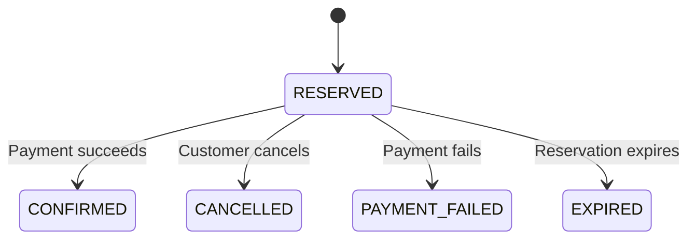

# Java Inventory Reservation Service

An inventory reservation service built with Java 21 and Spring Boot.

It uses PostgreSQL transactions to reserve stock, handles repeated requests with idempotency keys, and delivers order events through a transactional outbox.

[Architecture](docs/architecture.md) · [API documentation](docs/api.md)

## How it works



The service:

1. Identifies the customer through Spring Security and checks order ownership.
2. Uses the customer and idempotency key to identify repeated requests.
3. Locks the product row before reserving stock.
4. Saves the reservation, stock changes, and outbox event in one transaction.
5. Confirms or releases reserved stock when the order is paid, cancelled, or expired.
6. Publishes outbox events to Kafka and retries failed deliveries.
7. Records audit events and deduplicates them by event ID.
8. Caches product metadata in Redis while keeping inventory and order prices in PostgreSQL.

Stock always satisfies `available + reserved + sold = initial_stock`. Payment, cancellation, and expiry use the same locked transition so inventory changes only once.

Each order reserves one product. Payments are simulated, and the demo uses three configured accounts.

## Project structure

| Path | Contents |
| --- | --- |
| `src/main/java/` | Inventory, orders, security, cache, and event processing |
| `src/main/resources/` | Configuration, database migrations, and demo UI |
| `src/test/` | Unit, integration, concurrency, and browser tests |
| `scripts/` | HTTP smoke and contention checks |
| `docs/` | Architecture, API reference, and validation results |

## Build

Requirements:

- Docker with Compose v2
- Java 21 for Java tests; Maven is provided by the wrapper
- Node.js 22 or newer for JavaScript and browser tests
- Python 3 for HTTP checks

Build and start the demo:

```bash
docker compose up --build
```

Open [localhost:8080](http://localhost:8080).

| Account | Password | Access |
| --- | --- | --- |
| `alice` | `demo-alice-password` | Catalog and own orders |
| `bob` | `demo-bob-password` | Catalog and own orders |
| `admin` | `demo-admin-password` | Product creation, all orders, and simulated payments |

Create a product as `admin`, switch to `alice`, and reserve it. Replay the request to get the same order ID. Switch back to `admin` to confirm or fail payment. Unpaid demo reservations expire after 2 minutes.

These passwords are for local use. Compose binds the app to `127.0.0.1`; database and broker ports remain private. Configuration overrides are listed in [.env.example](.env.example).

Start with Kafka event delivery enabled:

```bash
docker compose -f compose.yml -f compose.events.yml --profile events up --build
```

Without Kafka, orders and outbox events are still saved. Pending events are delivered when the relay is enabled.

Stop the stack without deleting its data:

```bash
docker compose -f compose.yml -f compose.events.yml --profile events down
```

## Tests

Run application tests and JavaScript session tests:

```bash
./mvnw test
npm test
```

Run PostgreSQL and Redis integration tests with Docker:

```bash
./mvnw verify
```

Run browser tests against the running demo:

```bash
npm ci
npx playwright install --with-deps chromium
npm run test:browser
```

The suite covers stock contention, repeated requests, competing order transitions, Kafka delivery, Redis outages, authentication, and account switching.

[CI passed 87 tests](https://github.com/Parkryan0128/inventory-reservation-service/actions/runs/36465926585). See [validation results](docs/validation.md) for the environments and recorded outputs.

## Concurrency checks

Run an HTTP smoke check against the local demo:

```bash
python3 scripts/smoke.py
```

Send competing requests for limited stock:

```bash
python3 scripts/contention.py --requests 120 --stock 25 --workers 16
```

The script creates a product, checks the final inventory, and reports response counts and latency. The recorded CI run accepted 25 reservations and rejected the other 95 with insufficient stock.

To check Kafka delivery as well, run the smoke script with `--require-events` against the Kafka-enabled stack.

## Contact

- **Name:** Ryan Park
- **Email:** [parkryan0128@gmail.com](mailto:parkryan0128@gmail.com)
- **LinkedIn:** [linkedin.com/in/parkryan0128](https://www.linkedin.com/in/parkryan0128)
- **GitHub:** [github.com/Parkryan0128](https://github.com/Parkryan0128)
