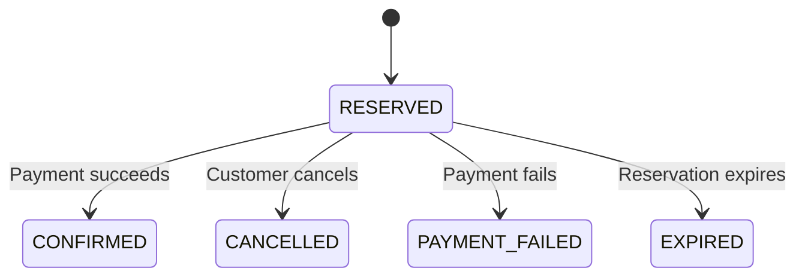

# Java Inventory Reservation Service

An inventory reservation service built with Java 21 and Spring Boot.

PostgreSQL handles stock and order transactions. Redis caches product metadata, and Kafka delivers order events through a transactional outbox.

[Architecture](docs/architecture.md) · [API documentation](docs/api.md)

## How it works



A reservation locks the product row and saves the stock change, order, and outbox event in one transaction. Retrying with the same customer, idempotency key, and payload returns the existing order.

Payment, cancellation, and expiry share a locked transition so stock changes only once. The database enforces `available + reserved + sold = initial_stock`.

The Kafka relay retries failed deliveries, and the consumer deduplicates audit events. Redis is used only for metadata; inventory and order prices come from PostgreSQL.

Each order contains one product. Payments are simulated.

## Project structure

| Path | Contents |
| --- | --- |
| `src/main/java/` | Inventory, orders, security, cache, and events |
| `src/main/resources/` | Configuration, database migrations, and demo UI |
| `src/test/` | Java, JavaScript, and browser tests |
| `scripts/` | HTTP smoke and contention checks |
| `docs/` | Architecture, API reference, and validation results |

## Build

Requires Docker with Compose v2.

```bash
docker compose up --build
```

Open [localhost:8080](http://localhost:8080). Use `admin` to create products and simulate payments, or `alice` and `bob` to reserve stock and view their own orders.

| Local account | Password |
| --- | --- |
| `alice` | `demo-alice-password` |
| `bob` | `demo-bob-password` |
| `admin` | `demo-admin-password` |

The demo is bound to localhost, and unpaid reservations expire after 2 minutes. Configuration overrides are in [.env.example](.env.example).

To enable Kafka delivery:

```bash
docker compose -f compose.yml -f compose.events.yml --profile events up --build
```

## Tests

Java tests require Java 21; JavaScript tests require Node.js 22 or newer.

```bash
./mvnw test      # Application tests and embedded Kafka
./mvnw verify    # Also runs PostgreSQL and Redis tests; requires Docker
npm test        # Demo session tests
```

Tests cover concurrent reservations, retries, order transitions, event delivery, cache outages, and access control. Browser setup and recorded results are in [validation results](docs/validation.md).

## Concurrency checks

With the demo running and Python 3 installed:

```bash
python3 scripts/smoke.py
python3 scripts/contention.py --requests 120 --stock 25 --workers 16
```

The recorded CI run accepted 25 reservations and rejected the remaining 95 with insufficient stock. The script checks the final inventory and reports response counts and latency.

## Contact

- **Name:** Ryan Park
- **Email:** [parkryan0128@gmail.com](mailto:parkryan0128@gmail.com)
- **LinkedIn:** [linkedin.com/in/parkryan0128](https://www.linkedin.com/in/parkryan0128)
- **GitHub:** [github.com/Parkryan0128](https://github.com/Parkryan0128)
