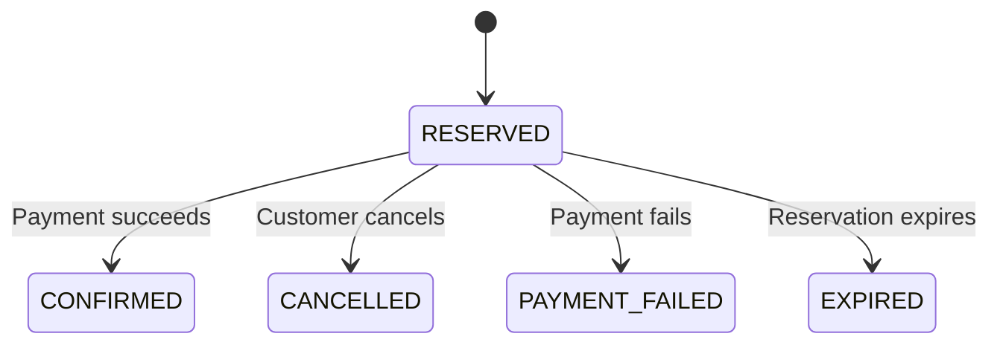

# Java Inventory Reservation Service

An inventory reservation service built with Java 21 and Spring Boot.

PostgreSQL handles stock and order transactions. Redis caches product metadata, and Kafka delivers order events through a transactional outbox.

[One-click demo](docs/demo.md) · [Architecture](docs/architecture.md) · [API documentation](docs/api.md)

## How it works



A reservation locks the product row and saves the stock change, order, and outbox event in one transaction. Retrying with the same customer, idempotency key, and payload returns the existing order.

Payment, cancellation, and expiry share a locked transition so stock changes only once. The database enforces `available + reserved + sold = initial_stock`.

The Kafka relay retries failed deliveries, and the consumer deduplicates audit events. Redis is used only for metadata; inventory and order prices come from PostgreSQL.

Each order contains one product. Payments are simulated.

## Project structure

| Path | Contents |
| --- | --- |
| `src/main/java/` | Inventory, orders, security, cache, events, and demo scenarios |
| `src/main/resources/` | Configuration, database migrations, and demo UI |
| `src/test/` | Java, JavaScript, and browser tests |
| `scripts/` | HTTP smoke and contention checks |
| `docs/` | Architecture, API reference, and validation results |

## Run the demo

Requires Docker with Compose v2.

```bash
docker compose up --build -d
```

Open [127.0.0.1:8080](http://127.0.0.1:8080/) and click **Run all 5 checks**. No login is needed. The page creates fresh demo products and checks concurrent reservations, idempotency, payment/cancellation/failure, competing order transitions, and expiry. Results come from real service calls and database reads, not a prerecorded animation.

The main contention check submits 120 calls through 16 server worker threads for 25 units. It expects 25 reservations and 95 insufficient-stock rejections. This exercises the same transactional service as the API; it is not a benchmark of 120 simultaneous HTTP connections. The expiry check advances only its generated order's deadline to avoid waiting two minutes.

The demo is bound to localhost and enabled only under the `demo` profile. Do not expose this profile publicly. Configuration overrides are in [.env.example](.env.example).

The original [manual API workspace](http://127.0.0.1:8080/index.html) remains available for account/ownership testing:

| Local account | Password |
| --- | --- |
| `alice` | `demo-alice-password` |
| `bob` | `demo-bob-password` |
| `admin` | `demo-admin-password` |

Use `admin` to create products and simulate payments, or `alice` and `bob` to reserve stock and view their own orders. Unpaid reservations expire after two minutes.

To enable Kafka delivery:

```bash
docker compose -f compose.yml -f compose.events.yml --profile events up --build -d
```

## Tests

Java tests require Java 21; JavaScript tests require Node.js 22 or newer.

```bash
./mvnw test      # Application and demo tests, including embedded Kafka
./mvnw verify    # Also runs PostgreSQL and Redis tests; requires Docker
npm test        # Session and one-click orchestration tests
```

Tests cover concurrent reservations, retries, order transitions, event delivery, cache outages, access control, and the no-login demo's isolation and error handling. Browser setup and recorded results are in [validation results](docs/validation.md).

## HTTP concurrency checks

With the demo running and Python 3 installed:

```bash
python3 scripts/smoke.py
python3 scripts/contention.py --requests 120 --stock 25 --workers 16
```

The recorded CI run accepted 25 reservations and rejected the remaining 95 with insufficient stock. The script checks the final inventory and reports response counts and latency.

## Contact

- **Name:** Ryan Park
- **Email:** [parkryan0128@gmail.com](mailto:parkryan0128@gmail.com)
- **LinkedIn:** [linkedin.com/in/parkryan0128](https://www.linkedin.com/in/parkryan0128)
- **GitHub:** [github.com/Parkryan0128](https://github.com/Parkryan0128)
