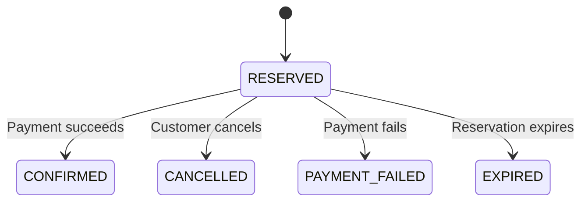

# Java Inventory Reservation Service

An inventory reservation service built with Java 21 and Spring Boot.

PostgreSQL handles stock and order transactions. Redis caches product metadata, and Kafka delivers order events through a transactional outbox.

[Dashboard guide](docs/demo.md) · [Architecture](docs/architecture.md) · [API documentation](docs/api.md)

## How it works



A reservation locks the product row and saves the stock change, order, and outbox event in one transaction. Retrying with the same customer, idempotency key, and payload returns the existing order.

Payment, cancellation, and expiry share a locked transition so stock changes only once. The database enforces `available + reserved + sold = initial_stock`.

The Kafka relay retries failed deliveries, and the consumer deduplicates audit events. Redis is used only for metadata; inventory and order prices come from PostgreSQL.

Each order contains one product. Payments are simulated.

## Project structure

| Path | Contents |
| --- | --- |
| `src/main/java/` | Inventory, orders, security, cache, events, and demo scenarios |
| `src/main/resources/` | Configuration, database migrations, and dashboard UI |
| `src/test/` | Java, JavaScript, and browser tests |
| `scripts/` | HTTP smoke and contention checks |
| `docs/` | Architecture, API reference, and validation results |

## Run the dashboard

Requires Docker with Compose v2.

```bash
docker compose up --build -d
```

Open [127.0.0.1:8080](http://127.0.0.1:8080/) and click **Run scenario**. The page explains the three-step purchase and reservation flow, then shows each scenario's setup and backend behavior beside the Backend activity terminal. The terminal shows inventory counters at the top and recorded results at the bottom. No login or manual product setup is needed.

Choose **Manual** to use one shared item with every visitor. It starts with 5 units only when first created; existing stock survives new sessions and server restarts. Add or remove up to 10 available units, buy a quantity, then confirm payment or cancel **your own order**. Separate browsers compete for the same stock. The terminal shows the latest 200 shared events, labelled **You**, an anonymous visitor, or **System** for expiry. Changes from other visitors are polled every four seconds; writes are never automatically retried. Actions are limited to one per 500 ms per session. Scenario fixtures remain separate from this shared item.

The default scenario submits 100 reservation service calls through 16 server workers for five units. It expects five reservations and 95 insufficient-stock rejections. Other presets cover duplicate requests, payment versus cancellation, the order lifecycle, and expiry.

The server records each completed service call. The browser replays those records progressively, with pause/resume, speed, filtering and replay controls. Log order is server observation order, not a reconstructed commit order. This is not a live HTTP/SQL log or a benchmark of 100 simultaneous browser connections. During reservation playback, derived inventory counts are explicitly labelled and reconciled with the recorded database snapshots. The expiry fixture advances only its generated order's deadline to avoid waiting two minutes.

The local Compose setup uses the localhost-only `demo` profile. Do not expose this profile publicly. Configuration overrides are in [.env.example](.env.example); detailed behavior and test setup are in the [dashboard guide](docs/demo.md).

For a public portfolio deployment, use the separate `public-demo` profile and the [VPS deployment guide](docs/deployment.md). It exposes the demo without opening the normal customer/admin APIs, preserves CSRF and session ownership, and serves HTTPS through Caddy. GitHub Actions publishes a commit-tagged image only after both local and public deployment checks pass; the VPS pulls that tested image.

The original [manual API workspace](http://127.0.0.1:8080/index.html) remains available for account/ownership testing:

| Local account | Password |
| --- | --- |
| `alice` | `demo-alice-password` |
| `bob` | `demo-bob-password` |
| `admin` | `demo-admin-password` |

Use `admin` to create products and simulate payments, or `alice` and `bob` to reserve stock and view their own orders. Unpaid reservations expire after two minutes.

To enable Kafka delivery:

```bash
docker compose -f compose.yml -f compose.events.yml --profile events up --build -d
```

## Tests

Java tests require Java 21; JavaScript tests require Node.js 22 or newer.

```bash
./mvnw test      # Application and demo tests, including embedded Kafka
./mvnw verify    # Also runs PostgreSQL and Redis tests; requires Docker
npm test        # Session, response validation and terminal replay logic
```

Tests cover concurrent reservations, retries, order transitions, event delivery, cache outages, access control, recorded activity, and demo isolation. Browser tests exercise progressive terminal rendering against Compose, inspect actual outcomes, verify playback without new writes, and check mobile layout and reduced motion. See the [dashboard guide](docs/demo.md) and [validation results](docs/validation.md) for test setup and earlier recorded acceptance runs.

## HTTP concurrency checks

With the demo running and Python 3 installed:

```bash
python3 scripts/smoke.py
python3 scripts/contention.py --requests 120 --stock 25 --workers 16
```

This separate HTTP check uses 120 requests and 25 units. It checks the final inventory and reports response counts and latency. The dashboard's five-unit scenario is a different workload.

## Contact

- **Name:** Ryan Park
- **Email:** [parkryan0128@gmail.com](mailto:parkryan0128@gmail.com)
- **LinkedIn:** [linkedin.com/in/parkryan0128](https://www.linkedin.com/in/parkryan0128)
- **GitHub:** [github.com/Parkryan0128](https://github.com/Parkryan0128)
