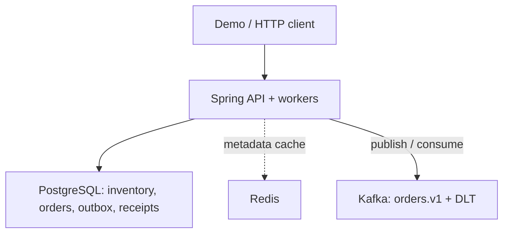
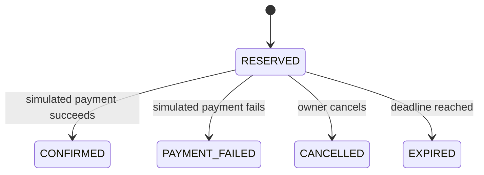

# Architecture and decisions

## Inventory and transactions

A product keeps `available`, `reserved`, `sold` and `initial_stock`. The database enforces nonnegative counters and `available + reserved + sold = initial_stock`. A reservation locks the product row, checks availability, moves available units into reserved units and inserts the order plus outbox event in one transaction. Integer cents avoid floating-point money calculations; each order snapshots the database price.

Pessimistic locking gives a straightforward correctness argument for a scarce product. It serializes requests for that product and limits throughput under contention. An atomic conditional update (`available >= quantity`) or optimistic locking with bounded retries would be sensible alternatives; neither removes the hot-product bottleneck. The Compose JDBC connection sets a five-second lock timeout. Lock contention maps to a retryable API error; callers should keep the same idempotency key.

## Idempotency race

The service checks `(owner, key)` before and after acquiring the product lock. A unique database constraint handles the harder case: the same owner's key racing across two different products. The losing transaction rolls back its stock mutation. `OrderPlacement` catches the uniqueness exception outside that rolled-back transaction, reads the winning order, and either returns it or rejects the conflicting payload.

Idempotency applies to request identity, not cached response bytes. Replaying a reservation after payment returns the original ID with its current terminal status. Keys remain bound for as long as the order is retained.

## Lifecycle

Transitions lock **order, then product**, and recheck the deadline after waiting for the locks. Confirmation moves reserved units into sold units; other terminal transitions release them. Repeating the same terminal action is a no-op. A conflicting terminal action returns `409`, except that an already expired order stays expired and is returned unchanged.

The expiry worker processes at most 50 due orders per pass; the next pass continues the backlog. The scheduler has two threads so a slow Kafka relay does not occupy the expiry worker's only thread. Deadline checks on write paths are authoritative even if background expiry is delayed.

## Events and failure windows

Each state change inserts a uniquely versioned outbox event within the order transaction. The relay scans 50 due records, locks one row, publishes using the order ID as Kafka key, and marks it published after acknowledgment. Retries back off from 2 to 60 seconds. A timeout or process crash after Kafka accepted the event but before the DB committed can create a duplicate: delivery is **at least once**.

Holding a DB lock during a bounded network call is deliberately simple and limits concurrent relay throughput. A claimed-batch/lease relay, `SKIP LOCKED`, or CDC would be follow-on designs, with additional recovery complexity. Multiple relay instances and retries can publish revisions out of order; a Kafka key does not fix ordering before publication. The audit receipt sink is commutative and tolerates this. A future current-state projection must apply revision checks.

The consumer inserts one receipt per event ID, with a unique constraint to settle competing deliveries. A conflicting payload for a previously seen event ID is rejected. Malformed events receive two retries and go to the explicitly configured `.DLT` topic. DLT publication failure is surfaced for retry. DLT replay, retention and operational alerting are follow-up work. This sink does not send email, ship goods, or charge a card; external side effects would need their own idempotency boundary.

## Cache and security boundaries

Redis contains only immutable-for-now product metadata, never inventory counters. Reads use a 30-second TTL and fail open to the database. Cache hit/miss/error counters have bounded tags. Optional Redis health does not gate API health; the database does.

HTTP Basic is used for a small configured demo identity set, and CSRF remains enabled. Identity is reconstructed from each authenticated request; the HTTP session stores the CSRF token. A caller-provided owner header is ignored. Cross-owner order access returns 404. Admin simulator/catalog/status/metrics access is separately restricted. All frontend data rendering uses text nodes. Internet deployment requires HTTPS and a real account/abuse-control design.

## Read next

- [Spring Security CSRF integration](https://docs.spring.io/spring-security/reference/servlet/exploits/csrf.html)
- [Spring Kafka exception handling](https://docs.spring.io/spring-kafka/reference/kafka/annotation-error-handling.html)
- [Apache Kafka Docker examples](https://github.com/apache/kafka/tree/4.0.1/docker/examples)
